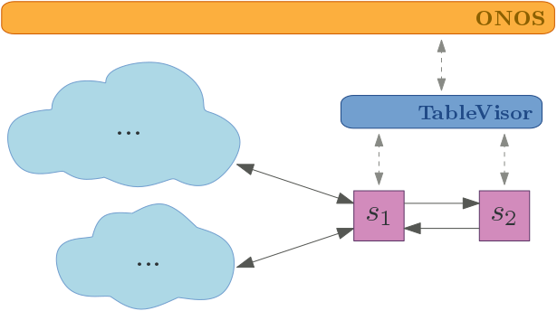

# Example 1: MPLS_PUSH in a Staged Pipeline

Example 1 is designed to be simple but still provide an idea of TableVisor's capabilities.
An overview of the scenario is presented in the following picture.

Assume we are operating a switch `s1` that is forwarding traffic based on an existing MPLS label, but it is unable to push an MPLS header to regular IPv4 packets.
We would like to enhance its capabilities by adding another device `s2` into the pipeline, pushing and setting MPLS labels based on the `ETH_DST` field.
In this simple scenario, only 2 ports of `s1` are in use (excluding our pipeline), while messages with `label=1` are forwarded to port `1`, and `label=2` is forwarded to port `2`.

## Setup

The actual setup of this example is presented in the following picture.

Both parts of the remaining network are represented by a single host.
The additional green switches were added to remove the MPLS header from incoming packets, so the hosts can actually read incoming packets.
They are not subject of the example itself.

For both switches `s1` and `s2`, we are only using their respective table `0`.
`s1.table0` is mapped to global `table0` and `table2`, while `s2.table0` is mapped to `table1`.
The following flow rules are pushed into the aggregated TableVisor switch:

| Global Table    | Local Table    | Match                              | Actions                                      | Priority |
| --------------- | -------------  | ---------------------------------- | -------------------------------------------- | -------- |
| `0`             | `s1.table0`    | `ETH_TYPE=ipv4`                    | `GOTO_TABLE 1`                               | 10       |
| `0`             | `s1.table0`    | `ETH_TYPE=mpls` and `MPLS_LABEL=1` | `OUTPUT PORT=1`                              | 10       |
| `0`             | `s1.table0`    | `ETH_TYPE=mpls` and `MPLS_LABEL=2` | `OUTPUT PORT=2`                              | 10       |
| `1`             | `s2.table0`    | `ETH_TYPE=ipv4` and `ETH_DST=h1`   | `MPLS_PUSH`, `LABEL=1`, `GOTO_TABLE 2`       | 10       |
| `1`             | `s2.table0`    | `ETH_TYPE=ipv4` and `ETH_DST=h2`   | `MPLS_PUSH`, `LABEL=2`, `GOTO_TABLE 2`       | 10       |
| `2`             | `s1.table0`    | `ETH_TYPE=ipv4`                    | `OUTPOT PORT=CONTROLLER`                     | 15       |

Note that the priority of the rule in table `2` is higher than the priorities in table `0`, as they share the same destination.
TableVisor transforms the rules into the following flows, as it passes the FlowMods to the devices:

| Switch          | Table ID       | Match                              | Actions                                      | Priority |
| --------------- | -------------  | ---------------------------------- | -------------------------------------------- | -------- |
| `s1`            | `0`            | `ETH_TYPE=ipv4`                    | `OUTPUT PORT=3`                              | 10       |
| `s1`            | `0`            | `ETH_TYPE=mpls` and `MPLS_LABEL=1` | `OUTPUT PORT=1`                              | 10       |
| `s1`            | `0`            | `ETH_TYPE=mpls` and `MPLS_LABEL=2` | `OUTPUT PORT=2`                              | 10       |
| `s1`            | `0`            | `ETH_TYPE=ipv4` and `IN_PORT=4`    | `OUTPOT PORT=CONTROLLER`                     | 15       |

| Switch          | Table ID       | Match                              | Actions                                      | Priority |
| --------------- | -------------  | ---------------------------------- | -------------------------------------------- | -------- |
| `s2`            | `0`            | `ETH_TYPE=ipv4` and `ETH_DST=h2`   | `MPLS_PUSH`, `LABEL=2`, `OUTPUT PORT=2`      | 10       |
| `s2`            | `0`            | `ETH_TYPE=ipv4` and `ETH_DST=h1`   | `MPLS_PUSH`, `LABEL=1`, `OUTPUT PORT=2`      | 10       |

Note that every `GOTO_TABLE` instruction that leads to another device is transformed into the corresponding `OUTPUT` instruction, while flows in the last table also receive an additional `IN_PORT=4` match.
This allows IPv4 communication between `h1` and `h2`, which will be tested with simple pings further below.

In order to work in the mininet environment, ARP requests must also be processed and answered.
In this setup, they are handled by a dedicated set of (default) ONOS apps, which install some further default rules into table `0`, forwarding various types of non-IPv4 traffic to the controller and handling ARP replies on the controller side. 